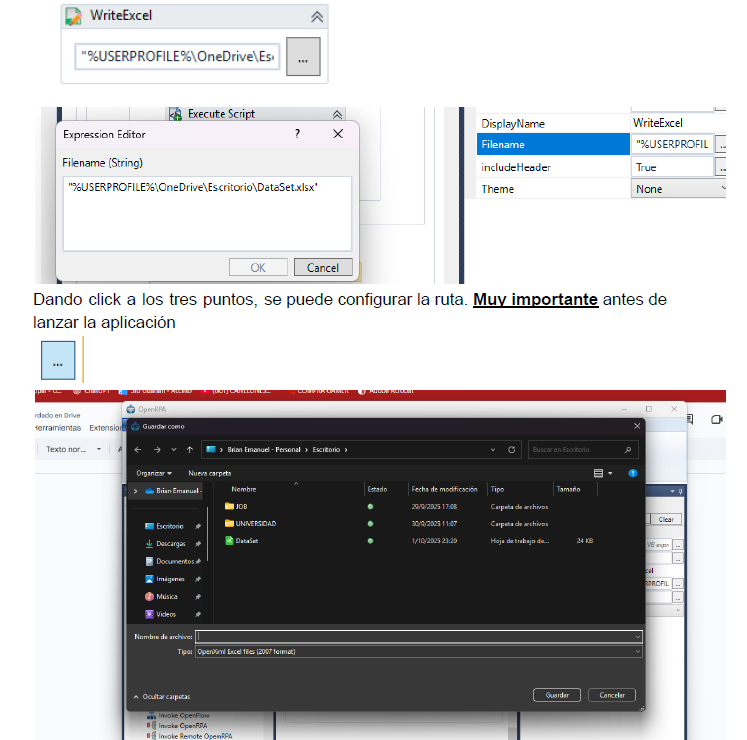

# 📌 UTN FRCU – Tecnologías para la Automatización [year]

## 👥 Team
- **Team number:** [Enter number]
- **Members:**
  - [TURIN BARRAGAN, Brian Emanuel]
  - [FRANZ, Baltazar]
  - [ESPINOSA, Eric]
  - [HAUNAU, Oscar]

---

## 🤖 Bot Description
- **Description:** 
This OpenRPA bot automates the process of collecting movie review data from the website filmaffinity.com. It navigates through the movie review pages, extracts relevant information such as review text, ratings and then organizes this data into a structured format. Once the information is collected, the bot exports it into an .xlsx Excel file, where each row corresponds to an individual review. This allows for easy storage, analysis, and reporting of the reviews without requiring manual copy-paste work.
- **Technology used:**
OpenRPA

---

## 🛠️ Usage Instructions
1. Step 1: Install the tool from the official website: https://openrpa.dk/openrpa. Click on the downloaded file and follow the steps.
2. Step 2: Download the .json file and then import it into the tool.
3. Step 3: Go to any movie page on the website (it doesn’t matter how you access it, only that you are on the movie page) and click “Play” in OpenRPA. 
           It is VERY IMPORTANT to first configure the path where the .xlsx file will be generated.

 *VIDEO DE PRUEBA*
 https://drive.google.com/file/d/1YVnP0zGIVClY4gABudFCBz108NjeE74j/view?usp=sharing

---

## 📝 Additional Notes
- 
- As of today, OpenRPA has virtually no documentation.
- The way it handles many tasks ends up being very unintuitive, which sometimes makes you wonder if it is really worth using.
- An interesting improvement would be to trigger the automation by pressing a key.
- Another improvement should be that the Excel file is not overwritten with each execution.
